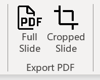

# Slide2Pdf



A PowerPoint Add-in that saves current slide as a PDF file in one click. It can crop the output PDF to fit visible content so the PDF file is ready to be inserted into a document with `\includegraphics{}` command, especially for LaTeX users who want to make figures with PowerPoint. Compared to [ppt2fig](https://github.com/elliottzheng/ppt2fig), this add-in does not require a Python environment and the output PDF has correct DPI for print quality.

这是一个一键保存当前幻灯片为 PDF 文件的 PowerPoint 插件。它可以裁剪输出的PDF以适应可见内容，特别适合 LaTeX 用户使用`\includegraphics{}`命令插入使用 PowerPoint 制作的图示。与 [ppt2fig](https://github.com/elliottzheng/ppt2fig) 相比，这个插件不需要 Python 环境，并且输出的 PDF 具有正确的打印质量 DPI。

It works on Windows 10 and 11 with PowerPoint 2013 and later.

插件支持 Windows 10 和 11，PowerPoint 2013 及更高版本。

## Installation

1. Download the latest release from [Releases](https://github.com/duanyll/Slide2Pdf/releases).
2. Unzip the downloaded file.
3. Click `setup.exe` and follow the instructions to install the add-in.
4. Open PowerPoint, the buttons should appear in the ribbon to the right of the "Home" tab.

You can also install the add-in with [Scoop](https://scoop.sh/):

```powershell
scoop bucket add duanyll https://github.com/duanyll/scoop-bucket
scoop install duanyll/slide2pdf
```

## 安装说明

1. 从 [Releases](https://github.com/duanyll/Slide2Pdf/releases) 下载最新版本。
2. 解压下载的文件。
3. 双击 `setup.exe` 并按照说明安装插件。
4. 打开 PowerPoint，按钮应该出现在“开始”选项卡的右侧。

也可以使用 [Scoop](https://scoop.sh/) 安装插件：

```powershell
scoop bucket add duanyll https://github.com/duanyll/scoop-bucket
scoop install duanyll/slide2pdf
```

## Changelog

- v1.0.0.3:
  - New feature: Remember the export location for each slide. Hold the `Shift` key while clicking the button to select a new location.
  - Now the buttons are placed in the "Home" tab by default. You can move them to any tab you like.
- v1.0.0.2: Initial release.

## 更新说明

- v1.0.0.3:
  - 新功能：记住每张幻灯片的导出位置。按住 `Shift` 键单击按钮以选择新位置。
  - 现在按钮默认放置在“开始”选项卡中。您可以将它们移动到任何选项卡。
- v1.0.0.2: 初始版本。

## Build and debug

Install the "Office/SharePoint Development" workload for Visual Studio 2022. Then open the solution file `Slide2Pdf.sln` in Visual Studio. You can build and debug the add-in from there.