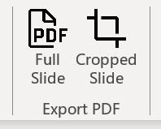

# Slide2Pdf



A PowerPoint Add-in that saves current slide as a PDF file in one click. It can crop the output PDF to fit visible content so the PDF file is ready to be inserted into a document with `\includegraphics{}` command, especially for LaTeX users who want to make figures with PowerPoint. Compared to [ppt2fig](https://github.com/elliottzheng/ppt2fig), this add-in does not require a Python environment and the output PDF has correct DPI for print quality.

这是一个一键保存当前幻灯片为 PDF 文件的 PowerPoint 插件。它可以裁剪输出的PDF以适应可见内容，特别适合 LaTeX 用户使用`\includegraphics{}`命令插入使用 PowerPoint 制作的图示。与 [ppt2fig](https://github.com/elliottzheng/ppt2fig) 相比，这个插件不需要 Python 环境，并且输出的 PDF 具有正确的打印质量 DPI。

The original VSTO add-in works on Windows 10 and 11 with PowerPoint 2013 and later. An Office.js add-in for current PowerPoint on macOS is under `office-addin/`.

原有 VSTO 插件支持 Windows 10 和 11、PowerPoint 2013 及更高版本。`office-addin/` 中另有适用于新版 macOS PowerPoint 的 Office.js 插件。

## Installation

1. Download the latest release from [Releases](https://github.com/duanyll/Slide2Pdf/releases).
2. Unzip the downloaded file.
3. Click `setup.exe` and follow the instructions to install the add-in.
4. Open PowerPoint, the buttons should appear in the ribbon to the right of the "Home" tab.

You can also install the add-in with [Scoop](https://scoop.sh/):

```powershell
scoop bucket add duanyll https://github.com/duanyll/scoop-bucket
scoop install duanyll/slide2pdf
```

## 安装说明

1. 从 [Releases](https://github.com/duanyll/Slide2Pdf/releases) 下载最新版本。
2. 解压下载的文件。
3. 双击 `setup.exe` 并按照说明安装插件。
4. 打开 PowerPoint，按钮应该出现在“开始”选项卡的右侧。

也可以使用 [Scoop](https://scoop.sh/) 安装插件：

```powershell
scoop bucket add duanyll https://github.com/duanyll/scoop-bucket
scoop install duanyll/slide2pdf
```

## macOS Office.js 版（开发预览）

这一版不调用 Microsoft Graph，也不会把演示文稿上传到 Slide2Pdf 的服务器。它在 PowerPoint 内用 `Document.getFileAsync(Office.FileType.Pdf)` 取得整份 PDF，然后在任务窗格中抽取当前页；“导出并裁切内容”还会按当前页所有可见对象的边界设置 PDF 的 CropBox 和 TrimBox。PDF 内容保持矢量格式。

要求：macOS 上的 Microsoft 365 PowerPoint，并支持 PowerPointApi 1.10。

首次安装和运行：

```bash
cd office-addin
npm install
npm run sideload
npm start
```

第一次执行 `npm start` 时，macOS 可能会要求信任本地 HTTPS 开发证书。保持开发服务器运行，完全退出并重新打开 PowerPoint，然后在“开始”选项卡选择 `Slide2Pdf` → `导出 PDF`。

任务窗格提供两种操作：

- `导出当前页`：抽取当前幻灯片，保留整页尺寸。
- `导出并裁切内容`：抽取当前幻灯片，再裁到可见对象的联合边界。

裁切边界与原 Windows 版保持一致，按当前幻灯片自身的顶层可见对象计算；母版/版式图形不参与边界计算，阴影或光晕等超出对象外框的效果可能被裁掉。

在上述 macOS 本地开发模式中，第一次为某页导出时会弹出系统保存框，后续导出会直接覆盖同一个文件；按住 Shift 点击可以另存。保存由只监听 `localhost` 的辅助接口完成，不经过 Microsoft Graph 或外部服务器。脱离本地辅助接口部署时，插件会优先使用浏览器的文件选择 API，不支持时再退回到下载位置。

常用检查命令：

```bash
npm run typecheck
npm test
npm run build
npm run validate
```

## Changelog

- v1.0.0.3:
  - New feature: Remember the export location for each slide. Hold the `Shift` key while clicking the button to select a new location.
  - Now the buttons are placed in the "Home" tab by default. You can move them to any tab you like.
- v1.0.0.2: Initial release.

## 更新说明

- v1.0.0.3:
  - 新功能：记住每张幻灯片的导出位置。按住 `Shift` 键单击按钮以选择新位置。
  - 现在按钮默认放置在“开始”选项卡中。您可以将它们移动到任何选项卡。
- v1.0.0.2: 初始版本。

## Build and debug

For the Windows VSTO add-in, install the "Office/SharePoint Development" workload for Visual Studio 2022. Then open `Slide2Pdf.sln` in Visual Studio.

For the macOS Office.js add-in, use the commands in the macOS section above. Its HTTPS server listens only on localhost. Presentation/PDF bytes are processed in the task pane and sent only to its loopback save endpoint when writing the selected local file; they aren't sent to Microsoft Graph or an external server.
